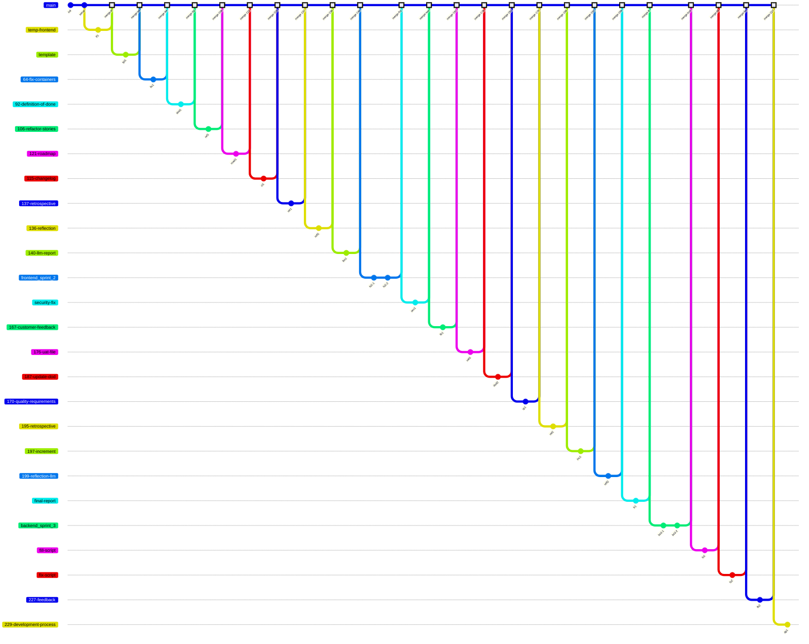

# Development Process and Configuration Management

This document outlines our team's shared workflow, sprint semantics, quality gates, and repository management rules.

---

## 1. Git Workflow Diagram

The following diagram illustrates our branching strategy, release cadences, and how features are integrated into the stable codebase.



### What the Diagram Shows

The diagram above is a **simplified representation** of our actual git history. It shows the key branching pattern used throughout the project:

- **`main` branch** (the central horizontal line) is the stable, production-ready branch. All work is integrated into `main` through pull requests.
- **Feature branches** (the branches that diverge from `main`) are created for each piece of work — whether it's a feature, bug fix, documentation update, or script change. Each branch is named with a convention: `<issue-number>-<short-description>` (e.g., `121-roadmap`, `64-fix-containers`) or a descriptive name (e.g., `frontend_sprint_2`, `backend_sprint_3`).
- **Merge commits** (highlighted nodes) represent pull request merges back into `main`. Each merge corresponds to a completed pull request that passed CI checks and was reviewed.
- The diagram shows **3 sprints** of work: Sprint 1 (initial setup, basic features), Sprint 2 (tags, filtering, UI refinement), and Sprint 3 (admin role, tag types, integration tests).

### How the Team Actually Uses This Workflow

1. **Branch creation**: When a team member starts working on an issue (user story, PBI, bug fix, or documentation task), they create a new branch from `main` using the naming convention `<issue-number>-<short-description>` or a descriptive name.

2. **Development**: Work is done on the feature branch with meaningful commit messages following the pattern `<type>- <description>` (e.g., `feature- add tags field`, `fix- fix n+1 problem`, `docs- add roadmap`).

3. **Pull request**: When work is complete, a pull request is opened against `main`. The PR template (`.github/pull_request_template.md`) guides the author to include relevant information.

4. **CI checks**: The CI pipeline (`.github/workflows/ci.yml`) runs automatically on pull requests to `main`. It includes:
   - Frontend lint and tests
   - Backend build and tests (with PostgreSQL)
   - Additional QA checks
   - Frontend-backend integration tests (Playwright)
   - Docker Compose smoke tests

5. **Review and merge**: After CI passes and the PR is reviewed by another team member, it is merged into `main`. The merge commit is highlighted in the diagram.

6. **Release**: At the end of each sprint, a release is created (e.g., `MVP-v1`, `MVP-v1.5`) and the changelog is updated.

---

## 2. Shared Workflow

### Branching Strategy

The team uses a **trunk-based development** approach with short-lived feature branches:

- **`main`** is the single source of truth. All work is merged into `main` through pull requests.
- **Feature branches** are created for each piece of work and merged back into `main` after review and CI validation.
- **No long-lived development branches** — all branches are short-lived and deleted after merging.

### Branch Naming Convention

| Type | Pattern | Example |
|---|---|---|
| Feature / PBI | `<issue-number>-<short-description>` | `121-roadmap` |
| Bug fix | `<issue-number>-<short-description>` | `64-fix-containers` |
| Documentation | `<issue-number>-<short-description>` | `137-retrospective` |
| Sprint branch | `<component>_sprint_<number>` | `frontend_sprint_2` |
| Script | `<descriptive-name>` | `fill-script` |

### Commit Message Convention

Commit messages follow the pattern `<type>- <description>`:

| Type | Meaning | Example |
|---|---|---|
| `feature-` | New functionality | `feature- add tags field for getAllGames` |
| `fix-` | Bug fix | `fix- fix n+1 problem` |
| `docs-` | Documentation | `docs: add roadmap` |
| `doc-` | Documentation (alternate) | `doc- update README` |
| `feat-` | Feature (alternate) | `feat- adding filter by tags` |
| `delete-` | Removal | `delete- remove deprecated frontend files` |
| `refactor-` | Code refactoring | `refactor- pom.xml for GDE Website project` |
| `scripts-` | Script changes | `scripts: add mock data scripts` |

### Pull Request Process

1. Create a branch from `main`
2. Make changes and commit with meaningful messages
3. Push the branch and open a pull request
4. CI checks run automatically (lint, tests, integration tests, smoke tests)
5. Another team member reviews the PR
6. After approval and CI passes, merge into `main`
7. Delete the feature branch

---

## 3. Sprint Structure

The project follows a **2-week sprint** cadence:

| Sprint | Date Range | Goal | Key Deliverables |
|---|---|---|---|
| Sprint 1 | 15.06.2026 - 21.06.2026 | Develop /games page, game creation, addition, editing | MVP-v1: games page, game CRUD, authentication |
| Sprint 2 | 22.06.2026 - 28.06.2026 | Finalize /game page, add filtering and tags | MVP-v1.5: tags, filtering, UI refinement, screenshots |
| Sprint 3 | 29.06.2026 - 05.07.2026 | Re-finalize /games page with additional sections | Admin role, tag types, integration tests |

### Sprint Workflow

1. **Planning**: Sprint goals and tasks are defined in the [roadmap](roadmap.md) and tracked via GitHub milestones.
2. **Development**: Team members work on issues assigned to the sprint milestone.
3. **Daily standups**: Team members share progress and blockers.
4. **Review**: At the end of the sprint, a customer review is conducted (UAT).
5. **Retrospective**: Team reflects on what went well and what can be improved.
6. **Release**: A new version is tagged and the changelog is updated.

---

## 4. Work Status and Traceability

### Issue Types

| Type | Description | Template |
|---|---|---|
| User Story (US) | End-user visible functionality | `.github/ISSUE_TEMPLATE/user_story.md` |
| PBI (Product Backlog Item) | Technical or non-functional work | `.github/ISSUE_TEMPLATE/other-pbi.yml` |
| Bug | Defect or regression | `.github/ISSUE_TEMPLATE/bug.yml` |
| Course Task | Academic assignment task | `.github/ISSUE_TEMPLATE/course-task.md` |

### Traceability

Each user story and PBI is linked to:
- A **GitHub issue** with acceptance criteria
- A **pull request** with CI evidence
- A **sprint milestone** for scheduling
- A **changelog entry** for user-visible changes

The traceability table in each weekly report links team members to their closed issues.

---

## 5. Definition of Done

The team's Definition of Done is documented in [definition-of-done.md](definition-of-done.md) and includes:

- All issue acceptance criteria are satisfied
- The work is reviewed by another team member
- For user stories, the linked supporting PBIs provide the required implementation, review, and verification evidence
- Required CI checks required for the product stack are passed
- Required automated quality requirement tests are passed
- Coverage expectations for critical modules
- Verification evidence is preserved in the normal workflow artifacts
- Pull requests and commits have meaningful names
- Changelog is updated for user-visible changes

---

## 6. Configuration Management

### Repository Structure

```
SWP_team30/
├── backend/          # Spring Boot backend (Java 21)
├── frontend/         # React frontend (Vite, Node 20)
├── docs/             # Project documentation
├── reports/          # Weekly reports and meeting notes
├── scripts/          # Utility scripts (DB, frontend, git)
├── observability/    # Logging and monitoring (Grafana, Loki, Prometheus)
├── compose.yaml      # Docker Compose for local development
├── compose.observability.yaml  # Observability stack
├── .github/          # GitHub Actions workflows, issue templates, PR template
└── CHANGELOG.md      # Version history
```

### Environment Configuration

- **`.env.example`** — Template for environment variables (committed to repo)
- **`.env.secret`** — Actual secrets (NOT committed, listed in `.gitignore`)
- **`.env.secret`** is stored as a GitHub Actions secret (`ENV_SECRET_FILE`) for CI

### CI/CD Pipeline

The CI pipeline (`.github/workflows/ci.yml`) runs on:
- Pull requests to `main` or `master`
- Pushes to `main` or `master`

Pipeline stages:
1. **Change detection** — determines which areas (frontend, backend, infra) changed
2. **Frontend lint** — ESLint checks
3. **Frontend test** — Vitest unit tests
4. **Frontend build** — Vite production build
5. **Backend build and test** — Maven verify with PostgreSQL
6. **Additional QA checks** — PowerShell QA script
7. **Frontend-backend integration** — Playwright E2E tests
8. **Docker Compose smoke** — Full stack startup verification

### Branch Protection

The `main` branch is protected with rulesets (visible in [Week 4 report images](../reports/week4/images/)):
- Direct pushes are forbidden
- Pull requests are required for merging
- CI checks must pass before merging
- At least one review is required

### PR Template

The pull request template (`.github/pull_request_template.md`) guides authors to include:
- Description of changes
- Link to related issue
- Testing evidence
- Checklist of Definition of Done items

---

## 7. Quality Gates

### Automated Checks

| Check | Tool | Trigger |
|---|---|---|
| Frontend lint | ESLint | PR to main |
| Frontend unit tests | Vitest | PR to main |
| Frontend build | Vite | PR to main |
| Backend build & test | Maven | PR to main |
| QA checks | PowerShell script | PR to main |
| Integration tests | Playwright | PR to main |
| Docker Compose smoke | Docker | PR to main |

### Quality Requirements

Quality requirements are documented in [quality-requirements.md](quality-requirements.md) and verified through [quality-requirement-tests.md](quality-requirement-tests.md).

---

## 8. Links

- [Definition of Done](definition-of-done.md)
- [Roadmap](roadmap.md)
- [Quality Requirements](quality-requirements.md)
- [Quality Requirement Tests](quality-requirement-tests.md)
- [Testing](testing.md)
- [Endpoint Testing](endpoint-testing.md)
- [User Acceptance Tests](user-acceptance-tests.md)
- [Changelog](../CHANGELOG.md)
- [CI Pipeline](https://github.com/Son-Go/SWP_team30/actions/workflows/ci.yml)
- [Product Backlog](https://github.com/users/Son-Go/projects/2/views/1)