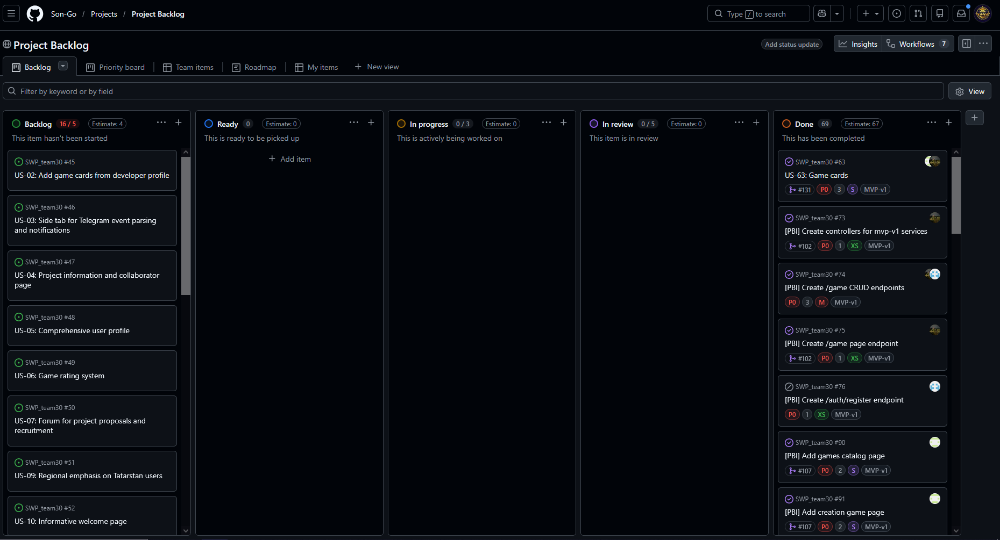
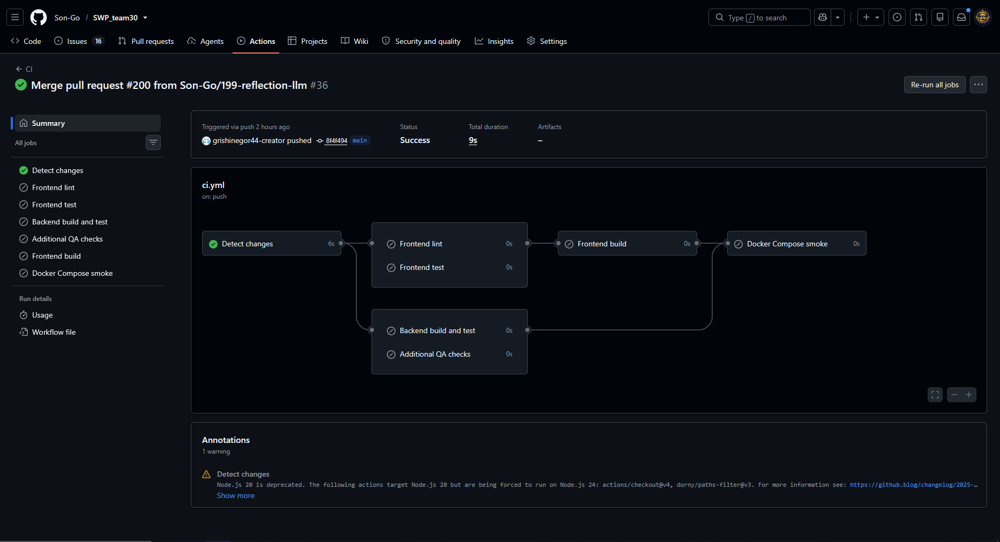
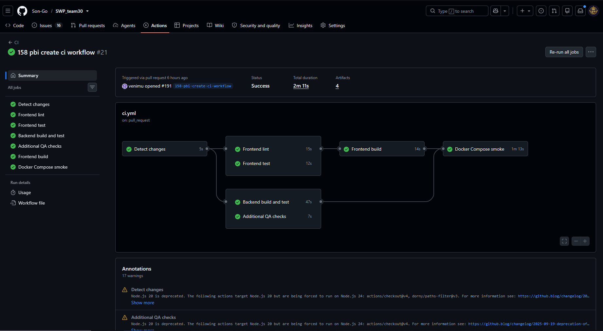
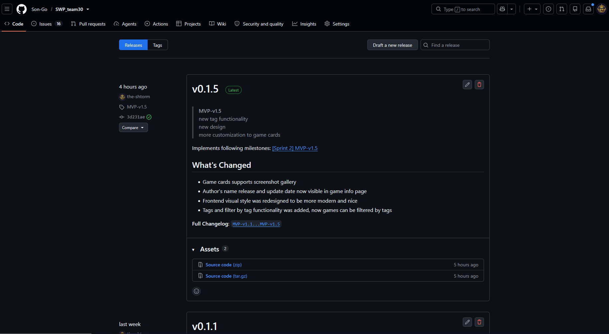
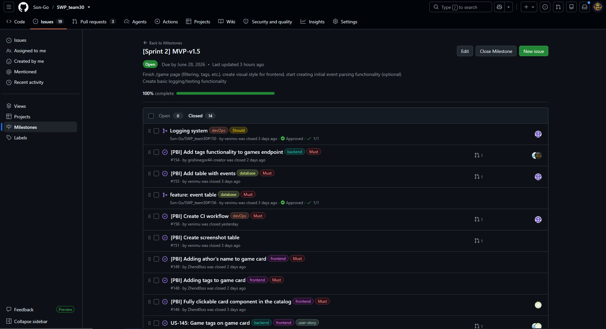

## About project

This is a GDE (Game Dev Evenings) Website project. Purpose of this project is to create website for Gamedev club in Innopolis University. Link to the [**LICENSE**](https://github.com/Son-Go/SWP_team30/blob/0f53ff1e18ba968bdb1a47d9a93787e763ab1cef/LICENSE)

## Customer feedback on MVP

| Feedback point | Resulting PBI or issue | Status | Response |
|---|---|---|---|
| Customer didn like 'To Game' button | [#146](https://github.com/Son-Go/SWP_team30/issues/146) | Done | Made entire game card clickable |
| The customer requested picture gallery for game info page | [#151](https://github.com/Son-Go/SWP_team30/issues/151) | Done | Picture gallery was implemented |
| Customer asked to chage sprint priority from events page to /game page finalizing | [[Sprint 2] MVP-v2](https://github.com/Son-Go/SWP_team30/milestone/2) | Done | Sprint priority was changed |

## Sprint 2 info

**Date:** 22.06.2026-28.06.2026

**Goal:** improve games page, add tags

**Summary:** In this sprint team implemented new design to website, improved UI, added game tags and tag filtering functionality and picture gallery to games

**Sprint size:** 22 points

## Quality model summary

The Sprint 2 follows ISO/IEC 25010 model and focuses on most important parts: protecting user data, preserving the public API contract, and keeping the main user flows reliable

Selected ISO/IEC 25010 sub-characteristics:

- Security / Authenticity: enforced for destructive and privileged operations such as game update and delete requests, where authentication is required before any change is accepted.
- Functional suitability: validated through explicit quality requirement tests for the public author endpoint and the core game-related API behavior.
- Reliability (indirectly): supported by CI smoke testing and Docker Compose startup checks, which verify that the backend and frontend can be brought up together without immediate failure.

These quality goals are documented in [quality-requirements](../../docs/quality-requirements.md) and verified through the checks described in [quality-requirement-tests](../../docs/quality-requirement-tests.md).

## Testing status

The project uses unit tests, HTTP integration tests, repository-level QA checks, and Docker Compose smoke tests as part of CI, as described in [testing](../../docs/testing.md).

Critical modules under test:

- Authentication and authorization: backend security behavior for login, current-user retrieval, and protected game update/delete operations.
- Games API and author endpoint: backend controller and HTTP contract tests for public and authenticated game flows.
- Frontend API client and games hook: Vitest-based tests for request handling, token management, and hook state transitions.
- Deployment configuration checks: QA checks for nginx authorization header forwarding, mock-auth disablement, and route contract consistency.

Per-module line coverage status:

- Backend auth and games endpoints: test coverage is present at the behavioral level through controller and HTTP integration tests, but no dedicated line-coverage report or minimum-threshold gate is currently documented in the repository.
- Frontend API client: covered by automated tests, but line coverage is not published or enforced in the current setup.
- Frontend games hook: covered by automated tests, but line coverage is not published or enforced in the current setup.
- Deployment/QA checks: these are static validation checks rather than coverage-based tests, so line coverage is not applicable.
  
## Test roadmap

In future sprints we will create tests for new features and increase project test coverage (which is now around 70-80%). In future sprints, when we will develop more sensitive code (such as admin panel or integrated merch shop) we will increase number of functional and non-functional tests

## UAT summary

UA tests was successfull in this sprint, customer aproved all increments, but requested several new features, such as video player support, login procedure changes and different tag types

## Summary of current status

Currently project statys in MVP-v1.5 state, because customer requested finalizing game page (as most important page) before any actions with other features. Project supports accounts registration, game creation/editing and filtering by tags

## Next steps summary

In next sprints we will finalize game page by adding different subsections and develop admin and user profile

## Tracebility table

Because each team member closed up to 10 issues, we will provide links to project issue page filtered by isssues for each team member

| Person | type of work| link |
|---|---|---|
| the-shtorm | documentation | [link](https://github.com/Son-Go/SWP_team30/issues?q=is%3Aissue%20state%3Aclosed%20assignee%3Athe-shtorm) |
| grishinegor44-creator | backend | [link](https://github.com/Son-Go/SWP_team30/issues?q=is%3Aissue%20state%3Aclosed%20assignee%3Agrishinegor44-creator) |
| Son-Go | backend | [link](https://github.com/Son-Go/SWP_team30/issues?q=is%3Aissue%20state%3Aclosed%20assignee%3ASon-Go) |
| venimu | devOps | [link](https://github.com/Son-Go/SWP_team30/issues?q=is%3Aissue%20state%3Aclosed%20assignee%3Avenimu) |
| Zhend0sss | frontend | [link](https://github.com/Son-Go/SWP_team30/issues?q=is%3Aissue%20state%3Aclosed%20assignee%3AZhend0sss) |

## Links

- [Product Backlog](https://github.com/users/Son-Go/projects/2/views/1)
- [Sprint Backlog](https://github.com/Son-Go/SWP_team30/issues/views/893)
- [Sprint 2 Milistone](https://github.com/Son-Go/SWP_team30/milestone/2)
- [Hosted project](http://gde.maxmir.ru)
- [Access instructions](../../README.md#access-instructions)
- [roadmap](../../docs/roadmap.md)
- [definition-of-done](../../docs/definition-of-done.md)
- [quality-requirements](../../docs/quality-requirements.md)
- [quality-requirement-tests](../../docs/quality-requirement-tests.md)
- [testing](../../docs/testing.md)
- [user-acceptance-tests](../../docs/user-acceptance-tests.md)
- [Unit test location (several folders)](../../backend/gde_website/src/test/java/gde/gde_website/)
- [Integration test location (one file)](../../backend/gde_website/src/test/java/gde/gde_website/EndpointHttpIntegrationTest.java)
- [QR test (same file, different functions)](../../backend/gde_website/src/test/java/gde/gde_website/EndpointHttpIntegrationTest.java)
- [CI pipline](https://github.com/Son-Go/SWP_team30/actions/workflows/ci.yml)
- [latest CI run](https://github.com/Son-Go/SWP_team30/actions/runs/28325873584) (latest run was documentational update, so most of the CI pipline wasnt activated due to redundancy of such check)
- [demonstration of all tests in one check](https://github.com/Son-Go/SWP_team30/actions/runs/28320398502/usage)
- [Sprint-2 release](https://github.com/Son-Go/SWP_team30/releases/tag/MVP-v1.5)
- [Changelog](../../CHANGELOG.md)
- [demo video](https://disk.yandex.ru/i/uQkjmHQBAXfhFg)
- [transcript](./customer-review-transcript.md)
- [review summary](./customer-review-summary.md)
- [reflection](./reflection.md)
- [retrospective](./retrospective.md)
- [llm-report](./llm-report.md)

## Images

Branch protection rules

Backlog

CI run

QA run

PR_issue

Release

Sprint milestone
