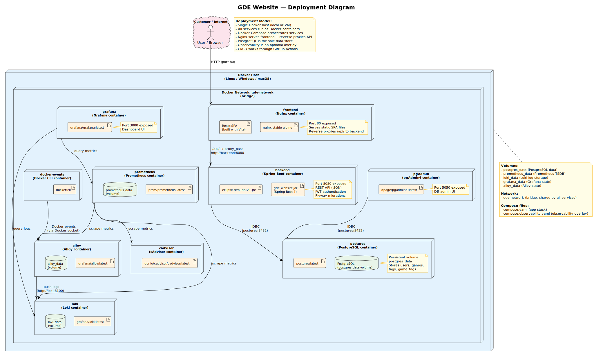
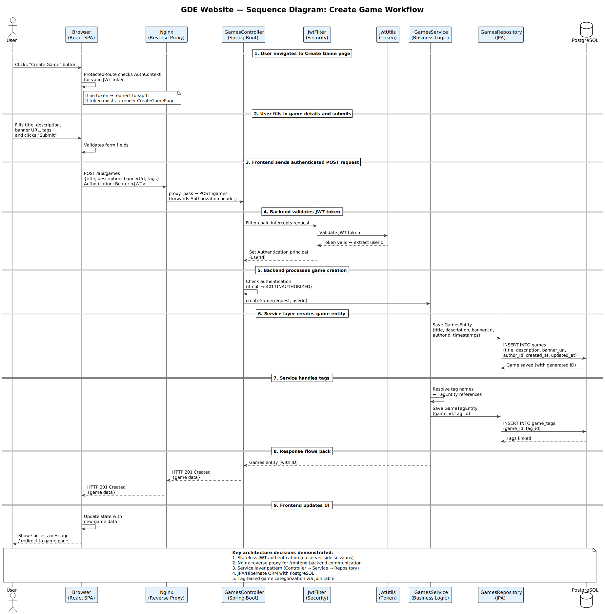
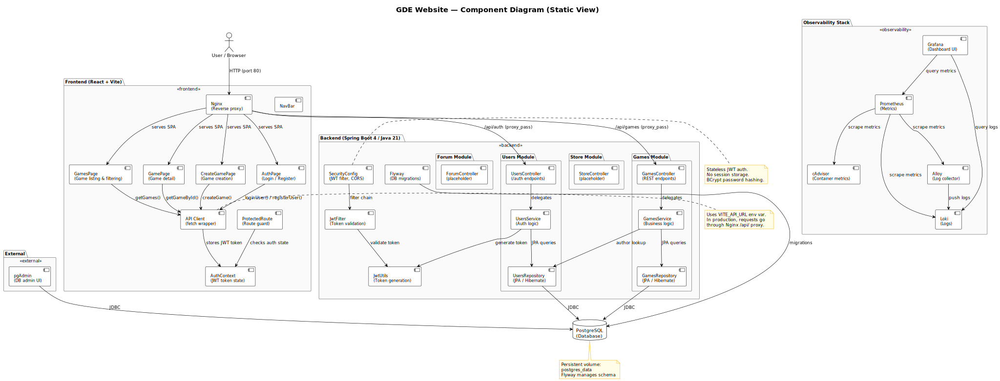
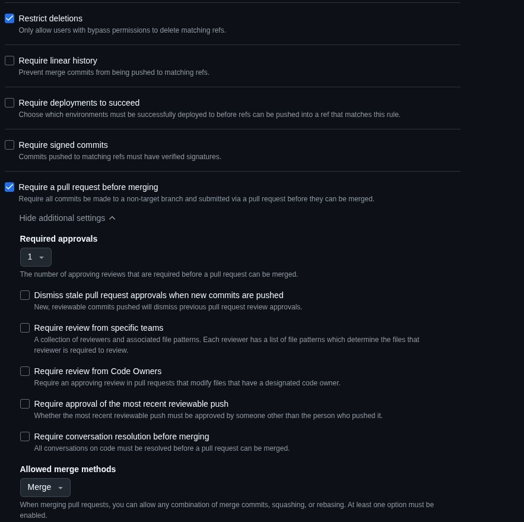
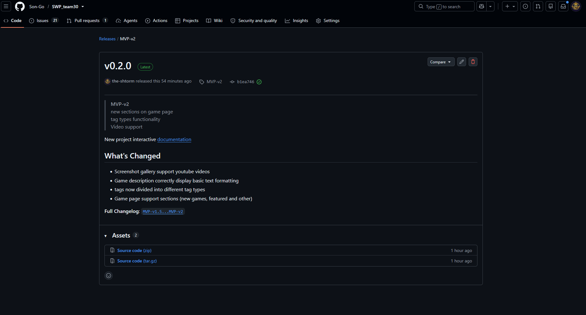
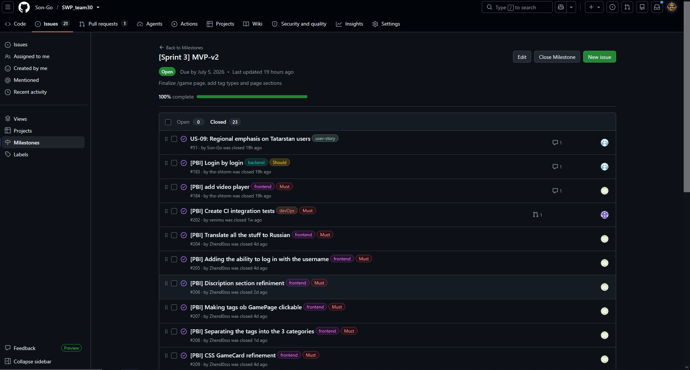

## About project

This is a GDE (Game Dev Evenings) Website project. Purpose of this project is to create website for Gamedev club in Innopolis University. Link to the [**LICENSE**](https://github.com/Son-Go/SWP_team30/blob/0f53ff1e18ba968bdb1a47d9a93787e763ab1cef/LICENSE)

## Hosted documentation site

The maintained project documentation is published as a browsable hosted site: [https://son-go.github.io/SWP_team30/](https://son-go.github.io/SWP_team30/)

## Sprint 3 info

**Date:** 29.06.2026-05.07.2026

**Goal:** improve games page, add tag types, video support

**Summary:** In this sprint team improved game page ui, added sections to game page and divided tags by types

**Sprint size:** 32 points

## Delivered changes

- Screenshot gallery support youtube videos
- Game description correctly display basic text formatting
- Tags now divided into different tag types
- Game page support sections (new games, featured and other)
- New project interactive [documentation](https://son-go.github.io/SWP_team30/)

## Customer feedback on MVP

| Feedback point | Resulting PBI or issue | Status | Response |
|---|---|---|---|
| Customer asked to divide tags by types | [#185](https://github.com/Son-Go/SWP_team30/issues/185) | Done | tags now separetad   |
| The customer requested youtube video player for game videos in picture gallery | [#184](https://github.com/Son-Go/SWP_team30/issues/184) | Done | Picture gallery supports videos |
| Customer asked to chage sprint priority from profiles and events to another round of game page finalizing | [[Sprint 3] MVP-v2](https://github.com/Son-Go/SWP_team30/milestone/3) | Done | Sprint priority was changed |
| Customer asked to add login functionality by login (additionaly to email) | [#183](https://github.com/Son-Go/SWP_team30/issues/183) | Done | Now users can login by login |
| Customer asked to translate entire website to russian | [#204](https://github.com/Son-Go/SWP_team30/issues/204) | Done | Now website is translated |

## Architecture summary

The system follows a **three-tier architecture** with a clear separation between frontend, backend, and database layers

| Layer | Technology | Purpose |
|-------|-----------|---------|
| **Frontend** | React 19 + Vite + Nginx | Application is served by Nginx, with reverse proxy to backend API |
| **Backend** | Spring Boot 4 + Java 21 | REST API with JWT authentication, JPA/Hibernate ORM, Flyway migrations |
| **Database** | PostgreSQL | Persistent data store for users, games, tags, and relationships |
| **Observability** | Grafana + Prometheus + Loki + Alloy + cAdvisor | Logging, metrics, and monitoring (optional overlay) |

- **Stateless authentication**: JWT tokens are used for authentication; no server-side sessions
- **Layered architecture**: Controller → Service → Repository pattern in the backend
- **Containerized deployment**: All services run as Docker containers orchestrated by Docker Compose
- **Separation of concerns**: Frontend and backend are independently buildable and deployable

## ADR to quality requirements

Authentication and Nginx ADR support simple client access to website logic, at the same time containerzed project simplifies maintainance and removes microservice management, because of project monolith

## CI summary

The baseline Assignment 4 gates remain active for the current MVP v2 scope:

- frontend lint, unit tests, and production build
- backend Maven verification with controller and HTTP integration tests
- additional QA checks for proxy, mock-auth, and route-contract risks
- Playwright end-to-end coverage, Docker Compose smoke testing, and documentation link checking

The current automated evidence is focused on the product areas that matter most for the sprint scope:

- authentication and authorization: register, login, profile access, and protected game update/delete operations
- game management: create, update, and delete flows through backend HTTP tests and the browser-based integration flow
- public author experience: the public author endpoint contract remains reachable and stable for the UI
- deployment and proxy correctness: QA scripts validate the nginx authorization header forwarding, the disabled mock-auth path, and the frontend/backend route contract
- architectural traceability: the test and CI evidence supports the accepted ADRs for JWT authentication, Docker Compose deployment, nginx reverse proxying, Flyway-backed persistence, and the layered backend design

## UAT summary

UA tests was successfull in this sprint, customer aproved all increments, but requested several new features, such as mini profile, small UI changes and drafted version of forum and profiles

## Summary of current status

Currently project in MVP-v2 state. For now Customer requested several more additional features for game page. Project supports accounts registration, game creation/editing and filtering by tags

## Next steps summary

In next sprints we will implement requested changes for game page and draft profiles with forums

## Tracebility table

Because each team member closed up to 10 issues, we will provide links to project issue page filtered by isssues for each team member

| Person | type of work| link |
|---|---|---|
| the-shtorm | documentation | [link](https://github.com/Son-Go/SWP_team30/issues?q=is%3Aissue%20state%3Aclosed%20assignee%3Athe-shtorm) |
| grishinegor44-creator | backend | [link](https://github.com/Son-Go/SWP_team30/issues?q=is%3Aissue%20state%3Aclosed%20assignee%3Agrishinegor44-creator) |
| Son-Go | backend | [link](https://github.com/Son-Go/SWP_team30/issues?q=is%3Aissue%20state%3Aclosed%20assignee%3ASon-Go) |
| venimu | devOps | [link](https://github.com/Son-Go/SWP_team30/issues?q=is%3Aissue%20state%3Aclosed%20assignee%3Avenimu) |
| Zhend0sss | frontend | [link](https://github.com/Son-Go/SWP_team30/issues?q=is%3Aissue%20state%3Aclosed%20assignee%3AZhend0sss) |

## Links

- [Product Backlog](https://github.com/users/Son-Go/projects/2/views/1)
- [Sprint Backlog](https://github.com/Son-Go/SWP_team30/issues/views/2313)
- [Sprint 2 Milistone](https://github.com/Son-Go/SWP_team30/milestone/3)
- [Hosted project](http://gde.maxmir.ru)
- [Access instructions](../../README.md#access-instructions)
- [roadmap](../../docs/roadmap.md)
- [definition-of-done](../../docs/definition-of-done.md)
- [quality-requirements](../../docs/quality-requirements.md)
- [quality-requirement-tests](../../docs/quality-requirement-tests.md)
- [testing](../../docs/testing.md)
- [user-acceptance-tests](../../docs/user-acceptance-tests.md)
- [devlopment-process](../../docs/development-process.md)

- [archiecture readme](../../docs/architecture/README.md)
- [adr-directory](../../docs/architecture/adr/)

- [CI pipline](https://github.com/Son-Go/SWP_team30/actions/workflows/ci.yml)
- [latest CI run](https://github.com/Son-Go/SWP_team30/actions/runs/28741848463) (latest run was documentational update, so most of the CI pipline wasnt activated due to redundancy of such check)
- [demonstration of all tests in one check](https://github.com/Son-Go/SWP_team30/actions/runs/28320398502/usage)
  

- [Sprint-3 release](https://github.com/Son-Go/SWP_team30/releases/tag/MVP-v2)
- [Changelog](../../CHANGELOG.md)
- [demo video](https://disk.yandex.ru/i/fDmV7AJWlhSSrg)
- [transcript](./sprint-review-transcript.md)
- [review summary](./sprint-review-summary.md)
- [reflection](./reflection.md)
- [retrospective](./retrospective.md)
- [llm-report](./llm-report.md)

## Images

Branch protection rules

CI run

PR_issue

Release

Sprint milestone

Backlog

Hosted Docsumentation

