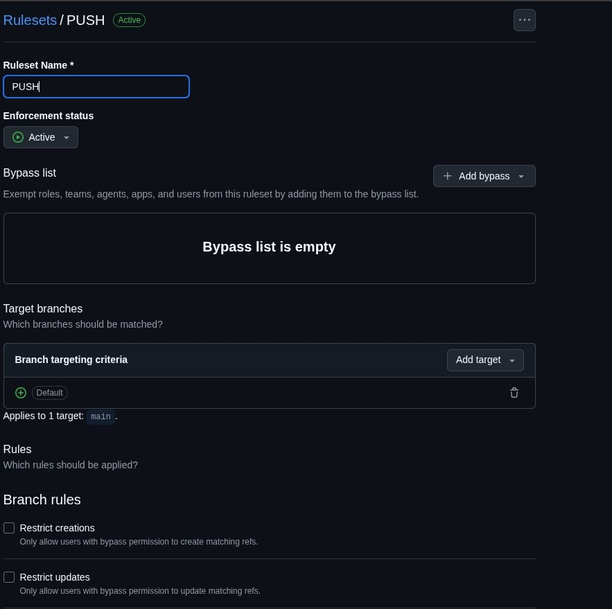
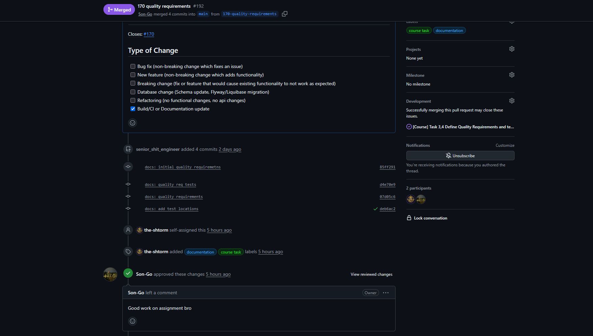
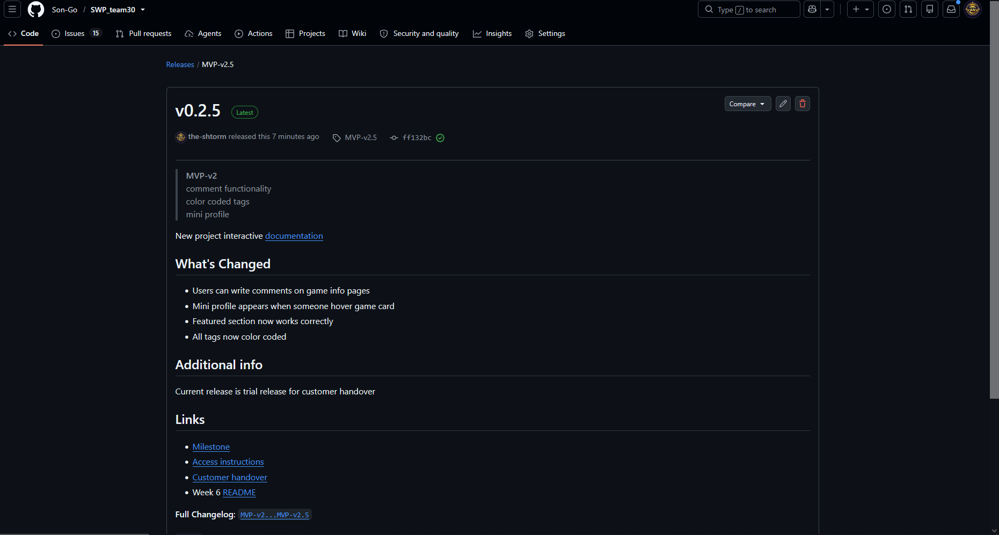

## About project

This is a GDE (Game Dev Evenings) Website project. Purpose of this project is to create website for Gamedev club in Innopolis University. 

Link to the [**LICENSE**](https://github.com/Son-Go/SWP_team30/blob/0f53ff1e18ba968bdb1a47d9a93787e763ab1cef/LICENSE)

## Hosted documentation site

The maintained project documentation is published as a browsable hosted site: [https://son-go.github.io/SWP_team30/](https://son-go.github.io/SWP_team30/)

## Sprint 4 info

**Date:** 06.06.2026-12.07.2026

**Goal:** improve UI, add comments and mini-profile

**Summary:** In this sprint team improved game page ui, comment support and mini profile for games

**Sprint size:** 27 points

## Trial release changes

- game cards show mini profile, when hovered
- users can leave comments on games
- Tags now color coded
- featured section on /game page now work correctly

## Customer feedback on MVP

| Feedback point | Resulting PBI or issue | Status | Response |
|---|---|---|---|
| Customer asked to add mini profile | [#251](https://github.com/Son-Go/SWP_team30/issues/251) | Done | mini profile exists |
| The customer asked to increase tags color diversity | [#252](https://github.com/Son-Go/SWP_team30/issues/252) | Done | Tags now color coded |
| Customer asked to chage sprint priority from profiles and events to another round of game page finalizing | [[Sprint 4] MVP-v2.5](https://github.com/Son-Go/SWP_team30/milestone/4) | Done | Sprint priority was changed |
| Customer asked to add comment fucntionality | [#281](https://github.com/Son-Go/SWP_team30/issues/281) | Done | Now users can login by login |

## UAT summary

UA tests was successfull in this sprint, customer aproved all increments, but requested new pages, such as admin page and "about us" page

## Summary of current status

Currently project in MVP-v2.5 state. Customer requested admin page and "about us" page in sprint 5

## Next steps summary

In next sprints we will implement requested pages and complete handover

## Customer-facing documentation review

Customer aproved our documentation and requested only minor changes for initial setup documentaion

## Transition readiness summary

Project can be transfered to cutomer at any moment, because of simple setup requiements, hovewer we still need to implement several new features to complete project

## Tracebility table

Because each team member closed up to 10 issues, we will provide links to project issue page filtered by isssues for each team member

| Person | type of work| link |
|---|---|---|
| the-shtorm | documentation | [link](https://github.com/Son-Go/SWP_team30/issues?q=is%3Aissue%20state%3Aclosed%20assignee%3Athe-shtorm) |
| grishinegor44-creator | backend | [link](https://github.com/Son-Go/SWP_team30/issues?q=is%3Aissue%20state%3Aclosed%20assignee%3Agrishinegor44-creator) |
| Son-Go | backend | [link](https://github.com/Son-Go/SWP_team30/issues?q=is%3Aissue%20state%3Aclosed%20assignee%3ASon-Go) |
| venimu | devOps | [link](https://github.com/Son-Go/SWP_team30/issues?q=is%3Aissue%20state%3Aclosed%20assignee%3Avenimu) |
| Zhend0sss | frontend | [link](https://github.com/Son-Go/SWP_team30/issues?q=is%3Aissue%20state%3Aclosed%20assignee%3AZhend0sss) |

## Links

- [Product Backlog](https://github.com/users/Son-Go/projects/2/views/1)
- [Sprint Backlog](https://github.com/Son-Go/SWP_team30/issues/views/3621)
- [Sprint 4 Milistone](https://github.com/Son-Go/SWP_team30/milestone/4)
- [Hosted project](http://gde.maxmir.ru)
- [Access instructions](../../README.md#-how-to-use-it)
- [README.md](../../README.md)
- [CONTRIBUTING.md](../../CONTRIBUTING.md)
- [AGENTS.md](../../AGENTS.md)
- [docs/customer-handover.md](../../docs/customer-handover.md)
- [roadmap](../../docs/roadmap.md)
- [definition-of-done](../../docs/definition-of-done.md)
- [quality-requirements](../../docs/quality-requirements.md)
- [quality-requirement-tests](../../docs/quality-requirement-tests.md)
- [testing](../../docs/testing.md)
- [user-acceptance-tests](../../docs/user-acceptance-tests.md)
- [devlopment-process](../../docs/development-process.md)

- [archiecture readme](../../docs/architecture/README.md)
  
- [Sprint-4 release](https://github.com/Son-Go/SWP_team30/releases/tag/MVP-v2.5)
- [Changelog](../../CHANGELOG.md)
- [demo video](https://disk.yandex.ru/i/Hn1ay1o6K_BwFg)
- [transcript](./sprint-review-transcript.md)
- [review summary](./sprint-review-summary.md)
- [reflection](./reflection.md)
- [retrospective](./retrospective.md)
- [llm-report](./llm-report.md)

## Images

Branch protection rules

CI run

PR_issue

Release

Sprint milestone

Backlog

Hosted Docsumentation
