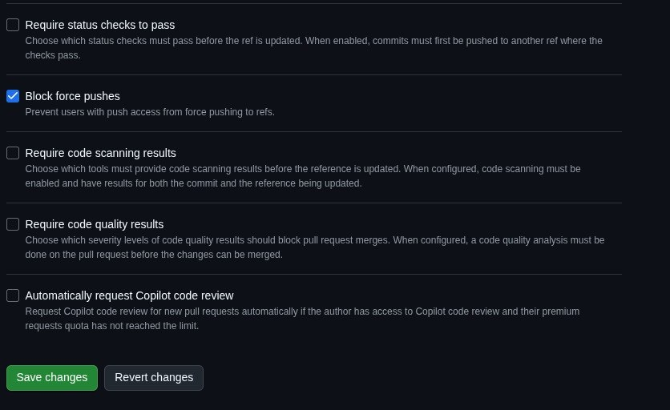
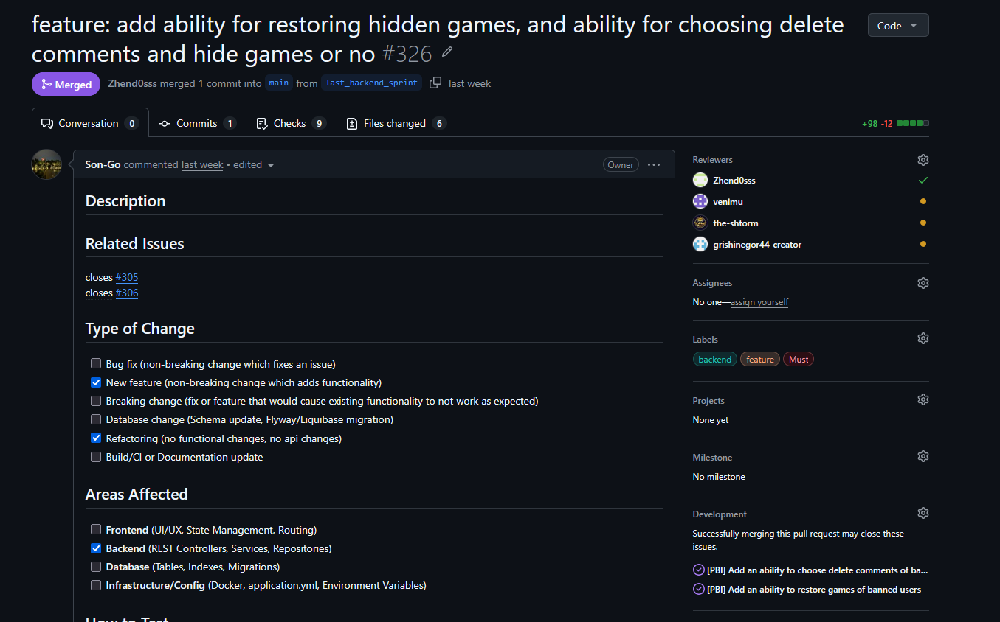
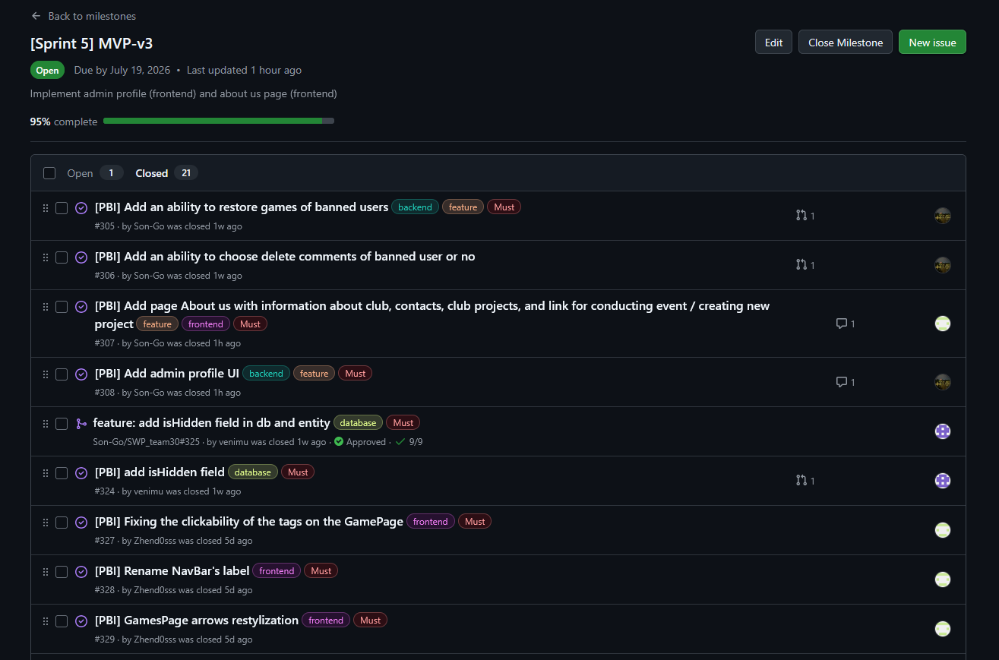
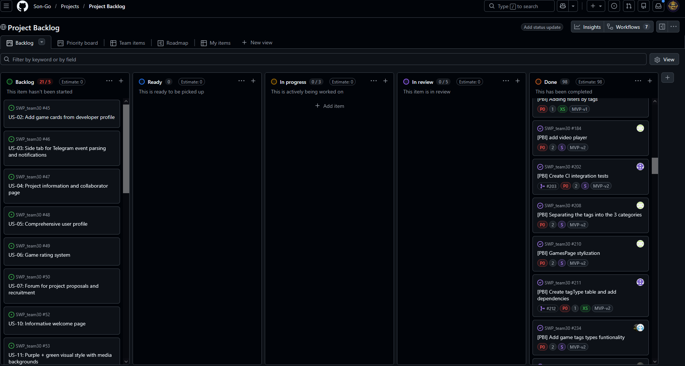
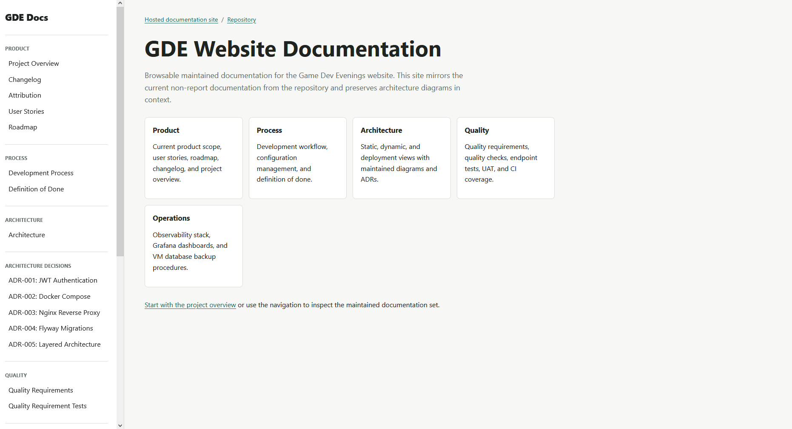

## About project

This is a GDE (Game Dev Evenings) Website project. Purpose of this project is to create website for Gamedev club in Innopolis University. 

Link to the [**LICENSE**](https://github.com/Son-Go/SWP_team30/blob/0f53ff1e18ba968bdb1a47d9a93787e763ab1cef/LICENSE)

## Hosted documentation site

The maintained project documentation is published as a browsable hosted site: [https://son-go.github.io/SWP_team30/](https://son-go.github.io/SWP_team30/)

## Sprint 5 info

**Date:** 13.06.2026-19.07.2026

**Goal:** polish project, add user and admin profile frontend, add "about us" page

**Summary:** In this sprint team fixed minor bugs, added frontend for user and admin profile and created "about us" page

**Sprint size:** 15 points

## Trial release changes

- user can see their info in user profile
- admin can see all users/games and ban them
- about us page

## Customer feedback on MVP

| Feedback point | Resulting PBI or issue | Status | Response |
|---|---|---|---|
| Customer asked to change limits of comments and descriptions | [#330](https://github.com/Son-Go/SWP_team30/issues/330) | Done | limits are increased |
| The customer asked to add delay before mini profile appears | [#333](https://github.com/Son-Go/SWP_team30/issues/333) | Done | added 1 second delay |
| Customer asked to change nav arrow style | [#329](https://github.com/Son-Go/SWP_team30/issues/329) | Done | Now arrows have new style |

## UAT summary

Customer executed some UAT on his own, no comments

## Summary of current status

Currently project in MVP-v3 state. Fully aproved and transfered, except minor fixes on "about us" page

## Customer-facing documentation review

Customer aproved our documentation and requested only minor changes for initial setup documentaion

## Handover status

**Handover status:** Ready for independent use, Accepted with follow-up items

Right now customer is not yet decided, when he will deploy and start use product, so it not yet used by the customer. 

Also customer approved user-facing documentation on prevoius week, hovewer we were unable to conduct meeting or get confirmation from the customer on week 7 due to internet shortage in the area, where customer was located this week. So right now we are in the semi-transitioned state because we were unable to contact to the customer

all handover info in [customer-handover.md](/docs/customer-handover.md)

## Tracebility table

Because each team member closed up to 10 issues, we will provide links to project issue page filtered by isssues for each team member

| Person | type of work| link |
|---|---|---|
| the-shtorm | documentation | [link](https://github.com/Son-Go/SWP_team30/issues?q=is%3Aissue%20state%3Aclosed%20assignee%3Athe-shtorm) |
| grishinegor44-creator | backend | [link](https://github.com/Son-Go/SWP_team30/issues?q=is%3Aissue%20state%3Aclosed%20assignee%3Agrishinegor44-creator) |
| Son-Go | backend | [link](https://github.com/Son-Go/SWP_team30/issues?q=is%3Aissue%20state%3Aclosed%20assignee%3ASon-Go) |
| venimu | devOps | [link](https://github.com/Son-Go/SWP_team30/issues?q=is%3Aissue%20state%3Aclosed%20assignee%3Avenimu) |
| Zhend0sss | frontend | [link](https://github.com/Son-Go/SWP_team30/issues?q=is%3Aissue%20state%3Aclosed%20assignee%3AZhend0sss) |

## Links

- [Product Backlog](https://github.com/users/Son-Go/projects/2/views/1)
- [Sprint Backlog](https://github.com/Son-Go/SWP_team30/issues/views/5201)
- [Sprint 5 Milistone](https://github.com/Son-Go/SWP_team30/milestone/5)
- [Hosted project](http://gde.maxmir.ru)
- [Access instructions](../../README.md#-how-to-use-it)
- [README.md](../../README.md)
- [CONTRIBUTING.md](../../CONTRIBUTING.md)
- [AGENTS.md](../../AGENTS.md)
- [docs/customer-handover.md](../../docs/customer-handover.md)
- [roadmap](../../docs/roadmap.md)
- [definition-of-done](../../docs/definition-of-done.md)
- [quality-requirements](../../docs/quality-requirements.md)
- [quality-requirement-tests](../../docs/quality-requirement-tests.md)
- [testing](../../docs/testing.md)
- [user-acceptance-tests](../../docs/user-acceptance-tests.md)
- [devlopment-process](../../docs/development-process.md)

- [archiecture readme](../../docs/architecture/README.md)
  
- [Sprint-5 release](https://github.com/Son-Go/SWP_team30/releases/tag/MVP-v3)
- [Changelog](../../CHANGELOG.md)
- [demo video](https://disk.yandex.ru/i/jtPAvb8QAt4_QQ)

- [review notes](./sprint-review-notes.md) (info, why we wasnt able conduct proper meeting with customer, described in these files)
- [review summary](./sprint-review-summary.md)
- [reflection](./reflection.md)
- [retrospective](./retrospective.md)
- [llm-report](./llm-report.md)

## Images

Branch protection rules

CI run

PR_issue

Release

Sprint milestone

Backlog

Hosted Docsumentation
